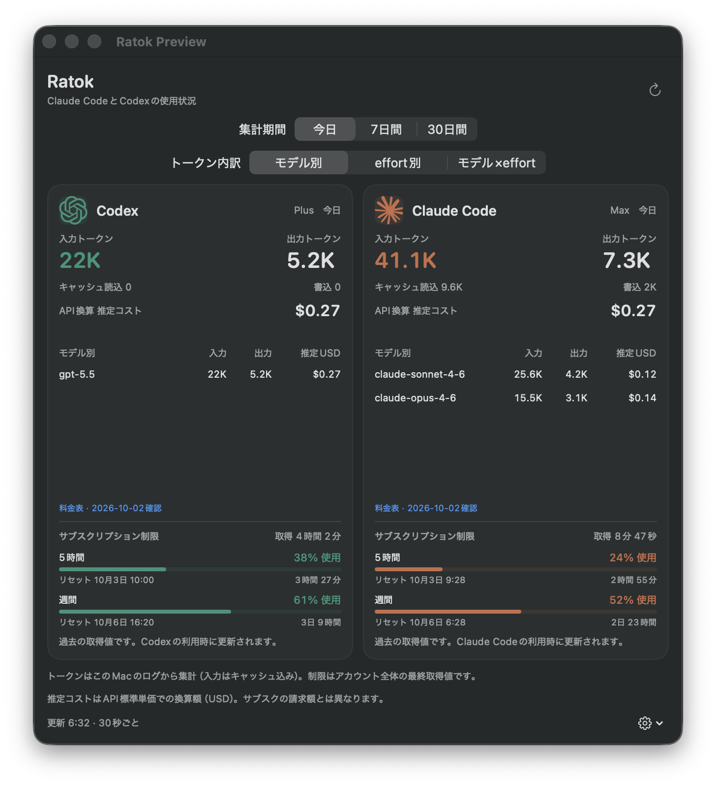

# Ratok

Claude CodeとCodexの使用状況をメニューバーから確認するmacOSアプリです。SwiftUI製で、自動更新にはSparkle 2を使用しています。macOS 14以降、ビルドにはSwift 6.2以降が必要です。



画面の数値はサンプルデータです。

## 特長

- メニューバーにCodex・CCそれぞれのアイコンと残量を表示（5時間枠を優先、未提供なら週間枠）。クリックでスクロール不要の詳細を開く
- 入力・出力トークン数、キャッシュ読込・書込を今日／7日間／30日間で集計
- モデル別・effort別・モデル×effortのトークン内訳を切り替え。行にカーソルを合わせるとキャッシュの内訳も表示
- トークン利用量をAPI標準単価へ換算した推定コスト（USD）を全体と内訳に表示
- サブスクリプション制限の使用率、リセット時刻、取得データの古さを表示
- 30秒ごとにローカルログの変更分を読み込む
- Claude Codeの既存status lineを保持する接続・解除

## ライセンス

Ratokのソースコードは[Apache License 2.0](LICENSE)で公開しています。個人・企業で利用、改変、再配布できます。特許ライセンスを含む条件はライセンス本文を参照してください。

CodexとClaudeのマークは各社の商標です。画像の出典とライセンスは[アイコンの帰属情報](Sources/Ratok/Resources/ATTRIBUTION.md)を参照してください。

## 起動

```sh
sh scripts/build-app.sh
open dist/Ratok.app
```

`dist/Ratok.app`をApplicationsへ移動して使えます。ローカルビルドはアドホック署名です。GitHub Releasesから配布するビルドはDeveloper ID署名と公証を行います。Xcodeで`Package.swift`を開くこともできます。

## Claude Codeの制限表示

ポップオーバーの「Claude Codeと接続」を一度クリックします。Claude Codeの次の応答後に制限が表示されます。Claude Code v2.1.251以降で公式に提供される`rate_limits`フィールドを利用します。claude.ai Pro／Maxなど、フィールドを提供する環境が対象です。各枠は個別に未提供になる場合があります。

接続時にユーザー設定の`statusLine.command`をラップし、元のコマンドに同じ標準入力を渡します。paddingなど既存の設定も保持します。設定を再読み込みしない既存セッションでは、Claude Codeを再起動してください。プロジェクト単位のstatus line設定がユーザー設定より優先される場合、その設定にも同様の連携が必要です。

歯車メニューの「Claude連携を解除」で元のstatus line設定に戻ります。接続後にユーザーが別のコマンドへ変更した場合は、その変更を保持します。連携用実行ファイルと元のstatus lineのバックアップは`~/Library/Application Support/Ratok/`へ保存されます。旧版の連携と保存済みレート制限情報も引き続き読み込みます。レート制限情報のみを保存し、認証トークンは読みません。

公式仕様: [Claude Code status line](https://code.claude.com/docs/en/statusline)

## データと集計

| 対象 | データ元 | 集計方法 |
| --- | --- | --- |
| Claude Code | `~/.claude/projects/**/*.jsonl`（サブエージェントを含む） | assistantのusageをメッセージ・リクエストIDで重複排除。キャッシュ読込・作成を入力に含める |
| Codex | `~/.codex/sessions/**/*.jsonl` | token_countの累積値の差分を集計。同じ累積値の繰り返しは加算しない |
| Claudeの制限 | status lineからの`rate_limits` | 接続以降に取得した5時間・週間・追加利用の枠 |
| Codexの制限 | token_countの`rate_limits`／`additional_rate_limits` | Codex全体の枠とログに記録された追加枠を個別表示。Luna Reserveなどの別枠は通常枠へ混ぜない |

Codexのデータ構造: [OpenAI Codex protocol](https://github.com/openai/codex/blob/main/codex-rs/protocol/src/protocol.rs)

内訳は合計と同じ期間・重複排除を使い、入力＋出力が多い順に表示します。Codexは`turn_context`の`model`／`effort`を次のターンまで適用し、セッション途中の切り替えも反映します。Claude Codeはassistantの`message.model`と`perTurnEffort`（未記録なら`effort`）を使います。記録がない項目は「不明」に含め、現在の設定から過去の値を推測しません。

推定コストは`（非キャッシュ入力×入力単価＋出力×出力単価＋キャッシュ読込×読込単価＋キャッシュ書込×書込単価）÷1,000,000`で計算します。キャッシュを通常入力と二重計上せず、Claudeの1時間書込は`usage.cache_creation.ephemeral_1h_input_tokens`で区別します。保持時間が未記録の書込は5分単価で換算します。effort別は各モデルで計算してから合算し、effortによる独自の倍率は掛けません。

2026-10-02確認の[OpenAI API料金](https://developers.openai.com/api/docs/pricing)・[Claude API料金](https://platform.claude.com/docs/en/about-claude/pricing)をアプリ内に保持し、アプリ更新時に更新します。対応モデルは以下の通りです。いずれも日時付きIDに対応します。

- GPT-6.1 Sol、GPT-6 Sol／Luna／Astra、GPT-5.6 Sol／Terra／Luna／Cyber。
- GPT-5.5、GPT-5.4、GPT-5.2、GPT-5.1、GPT-5と、公式単価のあるPro／mini／nano／Codex／chat-latest版。GPT-5.3はCodex／chat-latest版、GPT-5.1 Codexはmax／mini版も対応。
- `codex-mini-latest`、`chat-latest`。
- GPT-4.1／mini／nano、GPT-4o／mini、o1／Pro／mini／Preview、o3／Pro／mini、o4-mini。過去ログ用にGPT-4.5 Preview、GPT-4／Turbo／Turbo Preview、GPT-3.5 Turbo／instruct、ChatGPT-4o、davinci-002、babbage-002も対応。
- o3／o4-mini Deep Research、computer-use-preview、GPT-4o／mini Search Preview、GPT-5 Search API、GPT-Rosalind Research。Rosalindは公開されたAPI標準単価で換算し、公式の課金開始日は2026-10-05です。
- text-embedding-3-small／large、text-embedding-ada-002、omni-moderation-latest。公式に無料のモデルは$0.00と表示。
- Claude Fable 5／5.1、Mythos 5／5.1／Preview、Opus 5.5／5／4.8／4.7／4.6／4.5／4.1／4、Sonnet 5.5／5／4.6／4.5／4、Haiku 4.5／3.5。

`gpt-5.6`はSol、[Daybreak Blue](https://developers.openai.com/api/docs/models/gpt-daybreak-blue-latest)はGPT-5.6 Sol、[Daybreak Red](https://developers.openai.com/api/docs/models/gpt-daybreak-red-latest)はGPT-5.6 Cyberの公式別名として換算します。別名の対象も上記の確認日時点で固定しています。独立したキャッシュ単価がないモデルは通常入力単価で換算します。

Claudeは[公式のモデルID形式](https://platform.claude.com/docs/en/about-claude/models/model-ids-and-versions)に基づき、Bedrockの`anthropic.claude-…`（`-v1`／`-v1:0`付きも含む）とVertexの`@YYYYMMDD`付きIDもAnthropic API標準単価へ換算します。[Claudeモデルの状態一覧](https://platform.claude.com/docs/en/about-claude/model-deprecations)のActive全モデルと、まだ利用可能なDeprecatedモデルを含めています。Mythos Previewの基本単価は[Project Glasswingの公式発表](https://www.anthropic.com/glasswing)、キャッシュは[公式の倍率](https://platform.claude.com/docs/en/build-with-claude/prompt-caching)によります。

対象はログの入力・出力・キャッシュから換算できるテキストトークン料金です。画像生成・音声・動画のモデルは専用の利用内訳が必要なため対象外です。Open-weightモデルやファインチューニング済みモデル、公開単価を特定できない`gpt-reserve`／`codex-auto-review`、未対応モデル・モデル不明は計算から除外し、全て未対応なら「単価未対応」、一部が未対応なら金額に`*`と未対応トークン数を表示します。利用ゼロは$0.00、1セント未満の利用は<$0.01です。

金額は短いコンテキストのAPI標準単価によるUSDの目安です。実際のサブスクリプション請求額ではありません。Fast／長文／地域指定の割増、Batch割引、ツール料金、税は含みません。クラウド事業者独自の請求単価は使いません。過去の利用にも保持している単価を適用し、当時の請求額は再現しません。

トークン数はこのMacに残るログの範囲です。他のデバイス、Claude Web、ChatGPTなどの利用分は集計しません。アーカイブ／削除されたログも対象外です。期間はMacのタイムゾーンで今日の午前0時から、7日間は6日前、30日間は29日前の午前0時からです。

キャッシュは入力の内数、Codexの推論トークンは出力の内数です。サブスクリプションの使用率は取得値をそのまま表示し、トークン数から推測しません。Codexの追加枠やLuna Reserveはログに記録されている場合に限り表示します。APIキーで利用している場合など、制限情報が提供されない環境は未取得として表示します。リセット時刻を過ぎた取得値は「再取得待ち」になり、0%へ推測で更新しません。

`CLAUDE_CONFIG_DIR`／`CODEX_HOME`／`RATOK_SUPPORT_DIR`がアプリの環境に存在する場合はカスタムパスを利用します。Finderから起動したアプリにはシェルの環境変数が引き継がれない場合があります。

使用状況の取得はローカルで完結します。自動更新を有効にしたビルドでは、Sparkleが更新フィードと更新ファイルをHTTPSで取得します。会話内容は集計時にローカルで読み込み、メモリに保持するのはトークン数・日時・重複排除ID・モデル・effort・制限情報だけです。大きな期間の初回集計は時間がかかりますが、UIは操作できます。

## 検証

```sh
rtk swift test
rtk proxy .build/debug/Ratok --diagnose
```

テストでは累積値の重複、Claudeのストリーミング重複、日付境界、追記途中の行、ファイル置換、status lineの引き継ぎ・復元、モデル・effort集計、キャッシュ別のコスト計算を検証します。`--diagnose`は今日のトークン数・読み取ったファイル数・API換算推定コスト・単価未対応トークン数などの集計値を出力します。

UI確認用に`open -n dist/Ratok.app --args --preview`で同じ画面を通常のウィンドウでも開けます。

## 自動更新

歯車メニューの「アップデートを確認…」で手動確認できます。「アップデートを自動確認」は既定で有効、自動インストールは既定で無効です。自動インストールを有効にすると、Sparkleがバックグラウンドでダウンロードし、終了時にインストールします。設定は次回起動にも保存されます。更新の配布先が未設定のビルドとプレビューでは更新機能は無効です。

### GitHub Releasesと自動更新

`.github/workflows/release.yml`は、`v`で始まるタグをpushするとmacOSアプリをビルドし、Developer IDで署名・公証した後、Sparkleの署名付き`appcast.xml`とzipをGitHub Releaseへ公開します。アプリは固定URL`https://github.com/khirayama/ratok/releases/latest/download/appcast.xml`を確認し、公開後のReleaseから更新を取得します。

初回だけ、GitHubリポジトリの **Settings → Secrets and variables → Actions** に以下を設定してください。秘密鍵・証明書・パスワードはGitHub Actions Secretsへ、公開鍵はRepository variableへ登録します。

| 種類 | 名前 | 値 |
| --- | --- | --- |
| Variable | `RATOK_UPDATE_PUBLIC_KEY` | Sparkle Ed25519公開鍵 |
| Secret | `SPARKLE_PRIVATE_KEY` | Sparkleのエクスポート済み秘密鍵ファイルの内容 |
| Secret | `APPLE_CERTIFICATE_P12_BASE64` | Developer ID Application証明書の`.p12`をBase64化した内容 |
| Secret | `APPLE_CERTIFICATE_PASSWORD` | `.p12`の書き出し時に設定したパスワード |
| Secret | `KEYCHAIN_PASSWORD` | Actions上で一時キーチェーンを作るための任意のランダムなパスワード |
| Secret | `APPLE_ID` | Apple Developer ProgramのApple ID |
| Secret | `APPLE_APP_SPECIFIC_PASSWORD` | 公証用のApp用パスワード |
| Secret | `APPLE_TEAM_ID` | Apple Developer Team ID |

Sparkleの鍵は一度だけ生成します。公開鍵をRepository variableに設定し、秘密鍵をエクスポートしてSecretに設定してください。秘密鍵ファイルは安全な場所に保管し、リポジトリへ追加しないでください。

```sh
swift package resolve
.build/artifacts/sparkle/Sparkle/bin/generate_keys
.build/artifacts/sparkle/Sparkle/bin/generate_keys -x "$HOME/ratok-sparkle-private-key"
```

`.p12`はApple Developer ID Application証明書と秘密鍵をKeychain Accessから書き出して用意します。Base64文字列はmacOSで次のように作成します。

```sh
base64 -i DeveloperID.p12 | tr -d '\n'
```

Secretsとvariableを登録後、`v0.1.0`のような新しいタグをpushするとReleaseが公開されます。以降のリリースも同じ署名鍵を使い、`vMAJOR.MINOR.PATCH`を増やしてください。`workflow_dispatch`からもタグを指定して実行できます。Pull Requestでは公開ジョブは実行されません。

GitHub Releaseのzipは初回ダウンロードにも使えます。初回公開から自動更新を利用するには、必ずこのWorkflowで生成されたビルドをインストールしてください。ローカルの`build-app.sh`で作ったアプリには配布URLと公開鍵が入りません。

詳細は[Sparkle公式のセットアップ手順](https://sparkle-project.org/documentation/)を参照してください。
